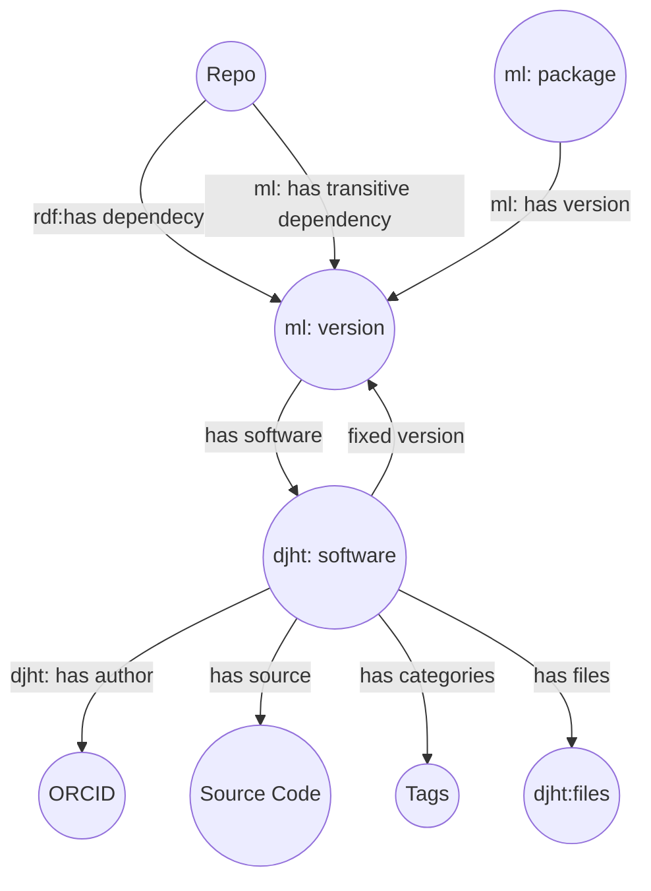

# Scientific open source Software (SOSS)

[](https://www.repostatus.org/#wip)

A repository that given an software arfefact DOI, it will computationally reproduce the software environment of the package.

## Description

This project aims to: (1) extract and link scientific software metadata from package files in a RDF KG and (2) recreate the software artefacts to compare with FAIR Maturity Evaluation services.


## Planning

- Add descriptors on existing RDF data model (reusing existing ontologies)
- Annotate the software deposits in the 4TUResearchData
- converting data to RDF and 
- Use either Shape validators or SPARQL queries
- Integrate into FAIR evaluator


## Materials and resources

#### Available software repositories [](https://awesome.re)
A list of research software registries (also known as catalog, index, warehouse, repository, hub, platform, and other terms) can be found here: [Awesome Research Software Registries](https://github.com/NLeSC/awesome-research-software-registries) 

* [Research software directory]()
* [4TUResearchData repository]()
* [TUD]()
* [Research Software Heritage]()
* [Marven Central Repository]()
* [Apache projects](https://projects.apache.org/)
* [ORKG](https://orkg.org)
* [Codewithpapers](https://paperswithcode.com/)


#### Available ontologies

Concepts and properties are annotated with:
* [GUIX Package difinitions](https://guix.gnu.org/manual/en/html_node/Defining-Packages.html)
* [Semanticscience Integrated Ontology (SIO)](https://bioportal.bioontology.org/ontologies/SIO/)
* [Software Ontology (SWO)](https://www.ebi.ac.uk/ols/ontologies/swo)
* [Research Software Ontology (RO)](https://wf4ever.github.io/)
* Ontology of Software Depencencies (OSD)
* [OKG-Soft](https://ieeexplore.ieee.org/document/9041835)
* [ML Schedma Core Specification](http://ml-schema.github.io/documentation/ML%20Schema.html)

#### Data Model
Explaining the elements of a knowledge graph for the research software artefacts:
* Source code repo: entity that host +1 packages/module
* Package: a sub-module that provides a reusable piece of software
* Version: a tag associated with a repo or package that identifies the unique instance or release of the source
* djht:software: a computational related flaw associated with versions of a repo or package 
<!-- has version: a one-to-many relationship between package and version
has STAR: a one-to-many relationship between version and STAR
has fixed version: (if any) a one-to-many relationship between STAR and fixed version
has dependency:
has transitive dependency -->


#### Example RDF (turtle):

```ttl
# metamodel_version: 1.7.0
@prefix djht: <http://djht.org/ontology/djht/> .
@prefix mls: <http://www.w3.org/ns/mls#> .
@prefix rdf: <http://www.w3.org/1999/02/22-rdf-syntax-ns#> .
@prefix schema: <http://schema.org/> .
@prefix sh: <http://www.w3.org/ns/shacl#> .
@prefix xsd: <http://www.w3.org/2001/XMLSchema#> .

djht:Container a sh:NodeShape ;
    sh:closed true ;
    sh:ignoredProperties ( rdf:type ) ;
    sh:property [ sh:class mls:Software ;
            sh:nodeKind sh:IRI ;
            sh:order 0 ;
            sh:path djht:softwares ] ;
    sh:targetClass djht:Container .

mls:Software a sh:NodeShape ;
    sh:closed true ;
    sh:ignoredProperties ( rdf:type ) ;
    sh:property [ sh:maxCount 1 ;
            sh:order 5 ;
            sh:path djht:tags ],
        [ sh:maxCount 1 ;
            sh:maxInclusive 200 ;
            sh:minInclusive 0 ;
            sh:order 4 ;
            sh:path djht:files ],
        [ sh:description "name of the repo" ;
            sh:maxCount 1 ;
            sh:minCount 1 ;
            sh:order 1 ;
            sh:path schema:name ],
        [ sh:maxCount 1 ;
            sh:order 2 ;
            sh:path djht:authors ],
        [ sh:maxCount 1 ;
            sh:order 7 ;
            sh:path djht:references ],
        [ sh:maxCount 1 ;
            sh:order 3 ;
            sh:path djht:categories ],
        [ sh:maxCount 1 ;
            sh:order 9 ;
            sh:path mls:function ;
            sh:pattern "^[\\d\\(\\)\\-]+$" ],
        [ sh:maxCount 1 ;
            sh:maxInclusive 200 ;
            sh:minInclusive 0 ;
            sh:order 10 ;
            sh:path djht:dependencies ],
        [ sh:maxCount 1 ;
            sh:order 6 ;
            sh:path djht:funding ],
        [ sh:maxCount 1 ;
            sh:order 0 ;
            sh:path djht:id ],
        [ sh:description "other names for the repo" ;
            sh:order 8 ;
            sh:path djht:aliases ] ;
    sh:targetClass mls:Software .
```
---
## License

**Copyright (C) 2023 - MIT License**


---
